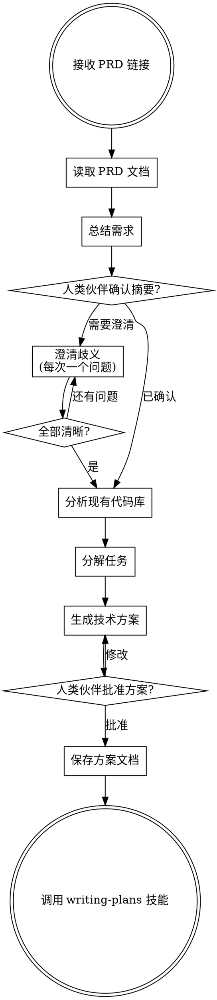

# PRD 驱动开发

## 概述

通过系统化的工作流，将 PRD 文档转化为结构化的技术方案：读取 PRD → 提取并澄清需求 → 分解开发任务 → 生成技术方案 → 交接给实施技能。

**启动时宣告：** "我正在使用 prd-driven-development 技能来分析 PRD 并生成技术方案。"

## 何时使用

- 你的人类伙伴提供了 PRD 文档链接（钉钉文档、语雀文档或本地 Markdown）
- 开始一个有书面需求文档的新功能开发
- 需要将产品需求转化为技术实现方案

## 何时不使用

- 没有 PRD 文档 — 改用 brainstorming 技能先探索想法
- PRD 已经被拆解为技术任务 — 直接使用 writing-plans 技能
- Bug 修复或重构 — 改用 systematic-debugging 或 brainstorming

## 检查清单

你必须按顺序完成以下步骤：

1. **读取 PRD 文档** — 获取并解析完整的文档内容
2. **总结需求** — 向你的人类伙伴呈现结构化摘要，等待确认
3. **澄清歧义** — 每次只问一个问题，逐步确认不清晰的需求
4. **分析现有代码库** — 探索项目结构、模式和相关模块
5. **分解任务** — 将需求拆解为独立的、可实施的开发任务
6. **生成技术方案** — 产出包含架构决策和任务分解的详细技术方案
7. **人类伙伴审批** — 呈现方案并获得明确批准
8. **保存方案文档** — 写入 `docs/superpowers/plans/YYYY-MM-DD-<feature-name>.md`
9. **过渡到实施** — 调用 writing-plans 技能创建详细的实施计划

## 流程图



**终态是调用 writing-plans。** 不要跳过直接进入实施，也不要调用其他技能。

## 步骤详情

### 步骤 1：读取 PRD 文档

#### 获取 PRD 内容

按优先级依次尝试以下方式，直到成功获取内容：

**方式一：工具直接读取（优先尝试）**

| 文档类型 | 读取方式 |
|---------|---------|
| **钉钉文档**（URL 包含 `dingtalk`） | 使用 `read_ali_doc` 工具 |
| **语雀文档**（URL 包含 `yuque`） | 使用 `read_ali_doc` 工具 |
| **本地 Markdown** | 使用 `read_file` 工具 |
| **其他 URL** | 使用 `web_fetch` 工具 |

**方式二：终端命令读取（工具读取失败时的备选）**

如果 `read_ali_doc` 或 `web_fetch` 因权限、授权、超时等原因失败，尝试使用终端工具通过 `curl` 访问页面获取内容。

**方式三：人类伙伴手动提供（以上方式均失败时）**

如果工具和终端都无法读取（常见原因：组织架构隔离导致授权不通），请向你的人类伙伴说明情况，并请求他们通过以下任一方式提供 PRD 内容：

> "我无法直接读取这个钉钉文档（可能是组织架构权限限制）。你可以通过以下方式帮我获取 PRD 内容：
>
> 1. **导出为本地文件**（推荐）— 在钉钉文档中导出为 Markdown 或 Word，保存到项目目录下，告诉我文件路径
> 2. **复制粘贴** — 将 PRD 全文复制粘贴到对话中（如果内容不太长）
> 3. **分段粘贴** — 如果 PRD 很长，可以分多次粘贴，每次粘贴一个章节，我会逐段记录"

等待人类伙伴提供内容后再继续。如果人类伙伴选择分段粘贴，你必须在收到所有段落后才进入步骤 2。

<HARD-GATE>
无论通过哪种方式获取 PRD 内容，都必须确保读取完整。PRD 文档可能非常长（数百甚至上千行）。你必须采用分段读取策略，确保不遗漏任何需求。
</HARD-GATE>

#### 分段读取策略

**第一步：先读取前 100 行，判断文档总长度和结构。**

- 使用 `should_read_entire_result=false`，设置 `start_line_one_indexed=1`，`end_line_one_indexed_inclusive=100`
- 从返回结果中获取文档总行数

**第二步：根据文档长度选择读取方式。**

| 文档长度 | 读取方式 |
|---------|---------|
| **≤ 200 行** | 直接整文件读取（`should_read_entire_result=true`） |
| **200-500 行** | 分 2-3 段读取，每段约 200 行 |
| **> 500 行** | 分多段读取，每段约 200 行，每段读完后立即提取该段的关键需求点 |

**第三步：对于超长文档（> 500 行），采用"边读边摘要"策略。**

每读完一段后，立即提取该段的关键信息：
- 该段涉及哪些功能模块
- 该段的核心需求点（用简短的要点列表记录）
- 该段是否有需要澄清的歧义

读完所有段落后，将各段摘要合并为完整的需求摘要。

**绝对禁止：**
- 只读了前面一部分就开始总结需求
- 跳过"附录"、"补充说明"、"非功能需求"等看似次要的章节
- 假设后面的内容和前面类似而不去读取

### 步骤 2：总结需求

按以下维度呈现结构化摘要：

- **背景与目标** — 这个功能为什么存在，解决什么问题
- **功能需求** — 系统必须做什么，按模块/功能组织
- **非功能需求** — 性能、安全、兼容性约束
- **范围边界** — 明确不在范围内的内容
- **核心实体与数据** — 涉及的核心数据模型和关系

询问你的人类伙伴："这个摘要是否准确地概括了 PRD？有没有我遗漏或误解的地方？"

### 步骤 3：澄清歧义

对于每个不清晰的点，**每次只问一个问题**。尽量使用选择题：

- 可以有多种理解方式的需求
- 缺失的边界情况定义
- 不明确的优先级或分期
- PRD 中未描述的对其他系统的依赖

### 步骤 4：分析现有代码库

在设计方案之前，先了解现有的代码：

- 项目结构和架构模式
- 与新功能相关的现有模块
- 会受影响的数据模型、API 和服务
- 正在使用的测试模式和规范
- 技术栈和依赖

### 步骤 5：分解任务

将 PRD 拆解为满足以下条件的开发任务：

- **独立性** — 每个任务可以独立实施和测试
- **有序性** — 按依赖关系排序（基础先行）
- **合理粒度** — 每个任务可在一个专注的会话中完成
- **可验证** — 每个任务有来自 PRD 的明确验收标准

### 步骤 6：生成技术方案

技术方案必须包含：

```markdown
# [功能名称] 技术方案

**来源 PRD：** [PRD 文档链接]
**日期：** YYYY-MM-DD

## 背景
[这个功能为什么存在，来自 PRD]

## 技术架构
[高层架构决策、组件设计、数据流]

## 影响分析
[哪些现有模块/文件会受影响，如何影响]

## 任务分解

### 任务 1：[任务名称]
- **对应 PRD 需求：** [实现 PRD 的哪个章节]
- **范围：** [这个任务覆盖什么]
- **涉及文件：** [需要创建/修改哪些文件]
- **验收标准：** [如何验证这个任务完成]

### 任务 2：...

## 风险与依赖
[技术风险、外部依赖、潜在阻塞点]

## 测试策略
[如何验证实现满足 PRD 需求]
```

### 步骤 7：人类伙伴审批

呈现完整方案并询问：

> "技术方案已就绪。请审阅架构决策和任务分解。这是否符合你对 PRD 的理解？在进入详细实施计划之前，是否需要调整？"

等待明确批准。如果有修改意见，修改后重新呈现。

### 步骤 8：保存并过渡

- 将方案保存到 `docs/superpowers/plans/YYYY-MM-DD-<feature-name>.md`
- 将文档提交到 git
- 调用 **writing-plans** 技能创建详细的分步实施计划

## 常见错误

| 错误 | 修正 |
|-----|------|
| 跳过 PRD 章节或只读了一部分 | 逐章节读完整个文档 |
| 编造 PRD 中没有的需求 | 只包含 PRD 明确描述的内容 |
| 未经人类批准就跳到编码 | 必须在步骤 7 获得明确批准 |
| 让所有任务互相依赖 | 尽可能设计独立的任务 |
| 忽略现有代码库的模式 | 在设计方案之前先分析代码库 |
| 一次问太多问题 | 每条消息只问一个问题，尽量用选择题 |
